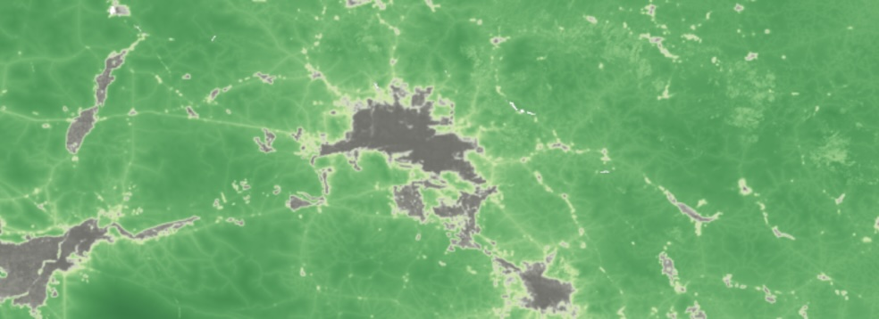

*UCSB MEDS* - *EDS 220 - Working With Environmental Datasets in Python*

# Phoenix Biodiversity Intactness Index Analysis
### Mapping the Change in Biodiversity from 2017 - 2020 in Phoenix, Arizona
     

**Author:** Nicole Pepper

<div style="text-align: left;">
  

### About the Repo:
[This repository](https://github.com/nicolelpepper/pheonix-bii-analysis) contains a Python Jupiter Notebook document that investigates the impacts of urban expansion by analyzing a dataset that captures values for the [Biodiversity Intactness Index (BII)](https://ai4edatasetspublicassets.blob.core.windows.net/assets/pdfs/io-biodiversity/Biodiversity_Intactness_whitepaper.pdf). [In 2021, Maricopa County —home to the Phoenix metropolitan area— was identified as the U.S. county with the most significant increase in developed land since 2001](https://www.washingtonpost.com/nation/interactive/2021/land-development-urban-growth-maps/). This rapid urban sprawl has profound implications for biodiversity and the health of surrounding natural ecosystems. I examine changes in BII in the Phoenix county subdivision area between 2017 and 2020, shedding light on how urban growth affects biodiversity over time.

**Link to Project Notebook:** https://github.com/nicolelpepper/phoenix-bii-analysis/blob/main/phoenix_bii_analysis.ipynb

### Technical Highlights:
- Programming in Python using `Jupyter Lab`
- Data retreival from Microsoft STAC catalog with `pystac_client`
- Vector data wrangling with `gpd`
- Raster data wrangling with `rioxarray` and `xarray`
- Data visualization with `matplotlib`
- Creating a map gif with `geogif`

### Data Descriptions:

- The `Biodiversity Intactness Index (BII) Time Series` data generated by Impact Observatory, in collaboration with Vizzuality, these datasets estimate terrestrial Biodiversity Intactness as 100-meter gridded maps for the years 2017-2020. For my analysis, I use the 2017 and 2020 rasters that cover the Phoenix metro area. I accessed the data using the `io-biodiversity` collection from the [Microsoft Planetary Computer STAC catalog](https://planetarycomputer.microsoft.com/dataset/io-biodiversity).

- The `Pheonix Subdivision Shapefile` data is a shapefile containing the perimeters of the Pheonix metro area. It is a subset of the Census County Subdivision shapefiles for Arizona. The data is a subset of Census County Subdivision shapefiles from the [U.S. Census Bureau](https://www.census.gov/programs-surveys/acs) from 2020 for Arizona. I accessed it on the [U.S. Census Bureau website](https://www.census.gov/cgi-bin/geo/shapefiles/index.php?year=2020&layergroup=County+Subdivisions). It is stored in my data folder as tl_2020_04_cousub.shp.

### Repo structure:

```
pheonix-bii-analysis
│   README.md
|   notebooks
|   .gitignore
│
└── data 
│    │   tl_2020_04_cousub.shp
│
└─── phoenix_bii_analysis.ipynb

```

### References:
  
- Impact Observatory - Vizzuality. (2022) *Biodiversity Intactness: White Paper*, https://ai4edatasetspublicassets.blob.core.windows.net/assets/pdfs/io-biodiversity/Biodiversity_Intactness_whitepaper.pdf.

- Impact Observatory - Vizzuality. [Data] [Biodiversity Intactness Index (BII) Time Series](https://planetarycomputer.microsoft.com/dataset/io-biodiversity) for 2017 and 2020. *Access date: 12/05/24* from https://planetarycomputer.microsoft.com/dataset/io-biodiversity

- U.S. Census Bureau (2020) [Data] Arizone Subdivisions Shapefile  *Access date: 12/05/24* https://www.census.gov/programs-surveys/acs
